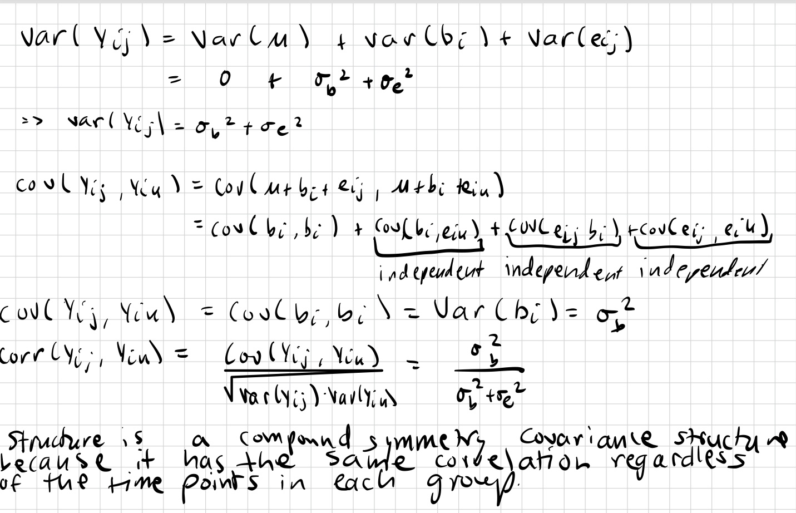
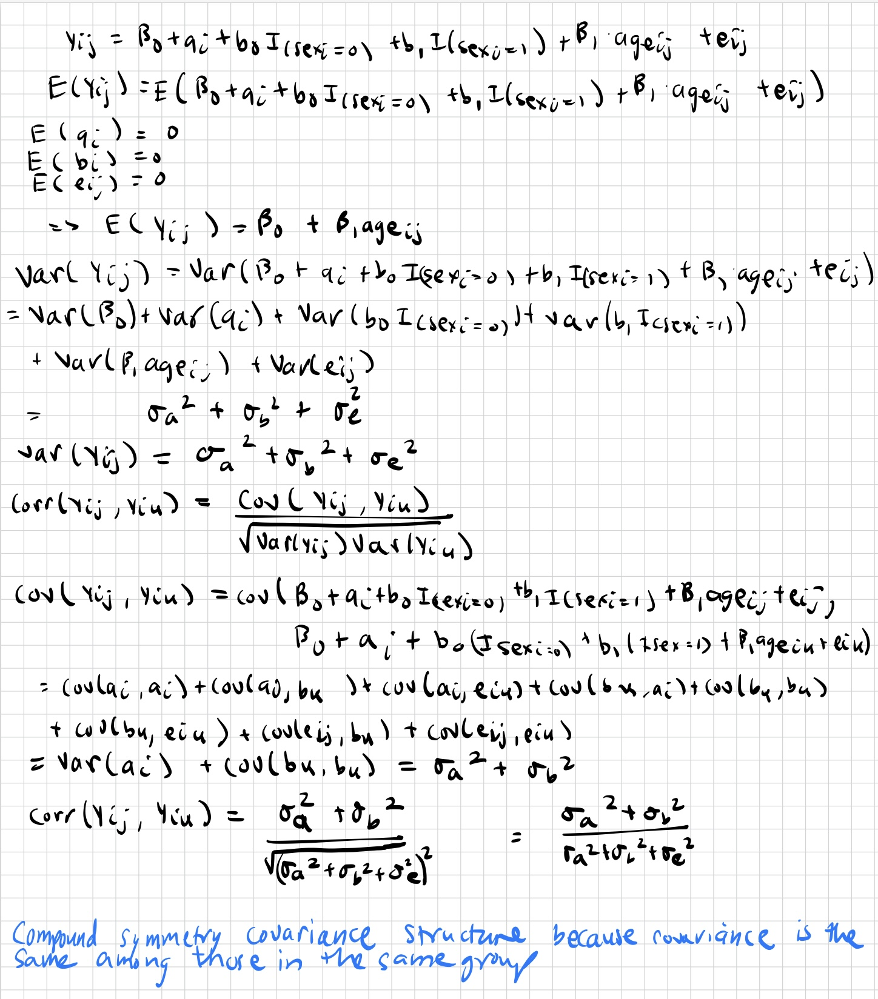

```{r setup}
library(tidyverse)
library(nlme)
```

# Problem 1 



# Problem 2 

## (a)
```{r}
data <- read.table("HW6-dental.txt") %>% drop_na() %>% as.data.frame() %>% slice(-1) %>% rename(Index = V1, Child = V2, Age = V3, Distance = V4, Gender = V5) %>% mutate(Age = as.numeric(Age),Distance = as.numeric(Distance), Gender = factor(Gender, levels = c(0,1)))

ggplot(data) + 
  geom_path(aes(x = Age, y = Distance, group = Child, color = factor(Gender, levels = c(0, 1)))) +
  ggtitle("Score change after intervention") +
  theme_classic() +
  labs(
    title = "Pituitary to Pterygomaxillary Distance by Age and Gender",
    x = "Age (years)", 
    y = "Distance", 
    color = "Gender"
  )

```

## (b)



## (c)

```{r}
fit_cs <- lme(Distance ~ Gender + Age, random = ~1 | Child, data = data,
                correlation = corCompSymm(form = ~1 | Child),  method='REML')
summary(fit_cs)
fit_exp <- lme(Distance ~ Gender + Age, random = ~1 | Child, data = data,
                 correlation = corExp(form = ~ Age | Child),  method='REML')
summary(fit_exp)
fit_ar1 <- lme(Distance ~ Gender + Age, random = ~1 | Child, data = data,
                 correlation = corAR1(form = ~ Age | Child), method='REML')
summary(fit_ar1)


```


```{r}
sm_cs <- summary(fit_cs)$tTable
sm_ar1 <- summary(fit_ar1)$tTable
sm_exp <- summary(fit_exp)$tTable

bind_rows(
  data.frame(
    Model = "Compound Symmetry",
    Intercept = sm_cs["(Intercept)", "Value"],
    Gender = sm_cs["Gender1", "Value"],
    Age = sm_cs["Age", "Value"]
  ),
  data.frame(
    Model = "AR(1)",
    Intercept = sm_ar1["(Intercept)", "Value"],
    Gender = sm_ar1["Gender1", "Value"],
    Age = sm_ar1["Age", "Value"]
  ),
  data.frame(
    Model = "Exponential",
    Intercept = sm_exp["(Intercept)", "Value"],
    Gender = sm_exp["Gender1", "Value"],
    Age = sm_exp["Age", "Value"]
  )
)

```

The intercept, gender and age coefficients for the compound symmetry and autoregressive covariance are the same. For the exponential covariance model, the intercept, gender, and age are similar to the others. 

```{r}
vcov(fit_cs) %>% knitr::kable()
vcov(fit_ar1) %>% knitr::kable()
vcov(fit_exp) %>% knitr::kable()
data.frame(
  Model = c("Compound Symmetry", "AR(1)", "Exponential"),
  AIC = c(
    as.numeric(summary(fit_cs)$AIC), 
    as.numeric(summary(fit_ar1)$AIC), 
    as.numeric(summary(fit_exp)$AIC)
  )
) %>% knitr::kable()
```

In all the models, age and gender are uncorrelated. The variance of the intercept in the compound structure and the ar 1 structure are slightly lower than the variance in the intercept in the exponential model. The variance in gender is similar among all the modes. The variance of age is larger in the exponential model than in the compound or AR 1 model. 

```{r}
fit_cs_comp <- lme(Distance ~ Gender + Age, random = ~1 | Child, data = data,
                correlation = corCompSymm(form = ~1 | Child),  method='ML')
summary(fit_cs)
fit_exp_comp <- lme(Distance ~ Gender + Age, random = ~1 | Child, data = data,
                 correlation = corExp(form = ~ Age | Child),  method='ML')
summary(fit_exp)
fit_ar1_comp <- lme(Distance ~ Gender + Age, random = ~1 | Child, data = data,
                 correlation = corAR1(form = ~ Age | Child), method='ML')
anova(fit_cs_comp, fit_exp_comp, fit_ar1_comp) 
```

Based on the AIC, BICm and log likelihood, the exponential covariate structure is the best. 